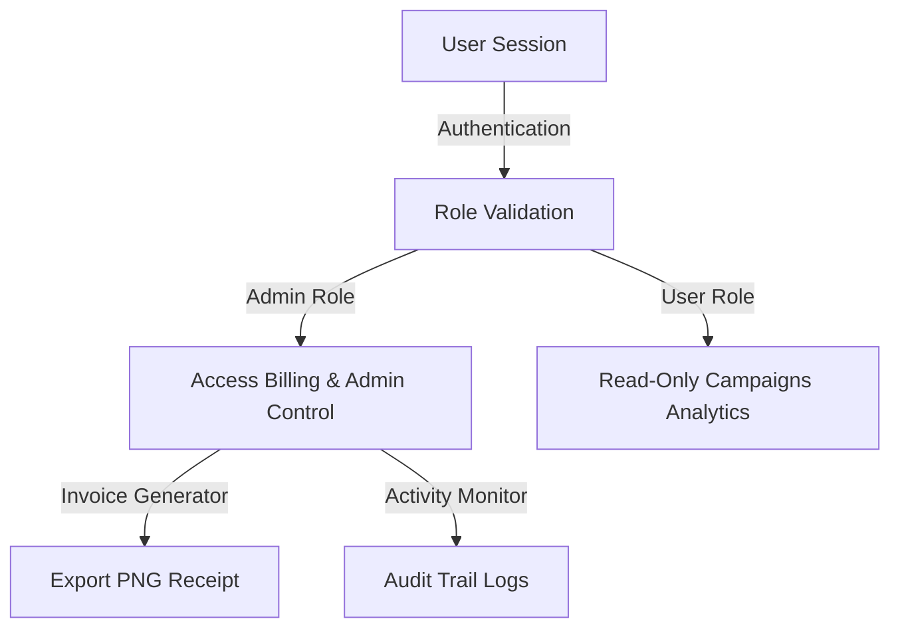

# 📊 Meta Ads Manager Replica (Delta Edition)

<div align="center">
  
  
  
</div>

---

A high-fidelity, interactive replica of the real **Meta Ads Manager** dashboard. Custom-built to manage, track, and showcase campaign performance analytics for **Delta Crypto Exchange** lead generation.

---

## ✨ Features at a Glance



### 📈 Core Modules
*   **KPI Performance Grid:** Real-time metrics tracking Spent Amount, Impressions, Clicks, CTR, CPC, Leads, CPL, and Reach.
*   **Dynamic Data Filtering:** Easily switch between campaigns and apply custom calendar date ranges.
*   **Three-Level Ad Hierarchy View:** Toggle tabs to view configurations for Campaigns, Ad Sets, and Ads.
*   **Invoice & Receipt Generator:** Capture payments and export professional PNG invoices directly from the web interface.
*   **Admin Audit Logging:** Comprehensive administrative console showing active logins, activity metrics, and system IPs.
*   **Anti-DevTools Shield:** Built-in scripts to discourage unauthorized console inspections.

---

## 🔒 Pre-Configured Administrator Credentials

Access the administrative functions of the dashboard using these credentials:

| Administrator | Email | Password | Role |
| :--- | :--- | :--- | :--- |
| **Sanjev Marketing** | `sanjevmarketing@gmail.com` | `sanjev@11` | `Admin` |
| **Aditya Jangam** | `adityajangam@2124` | `Aditya@2111` | `Admin` |

---

## 🎯 Active Campaign Profile

Our primary running promotion focuses on capturing high-intent USDT buyers:

*   **Campaign Name:** `USDT Seller Lead Generation`
*   **Targeting Audience:** `Crypto & Trading Interest Audience`
*   **Daily Budget Limit:** `₹70,000 INR`
*   **Current Results:** `42 Leads Captured`
*   **Average CPL:** `₹357.14 INR`
*   **Impressions:** `111,450`

---

## 📂 Repository Layout

```bash
├── assets/                  # High-quality creative ad images (suv.png, luxury.png, etc.)
├── index.html               # Main dashboard source code (HTML, custom CSS, JS)
├── META.html                # Backup reference template
└── README.md                # Project documentation and specifications
```

---

## 💻 Tech Stack & Customizations
*   **Frontend Logic:** Vanilla Javascript with reactive data bindings.
*   **Data Charts:** Interactive line/bar renderings using [Chart.js](https://www.chartjs.org/).
*   **Visual Assets:** Dynamic icons provided by [Lucide Icons](https://lucide.dev/).
